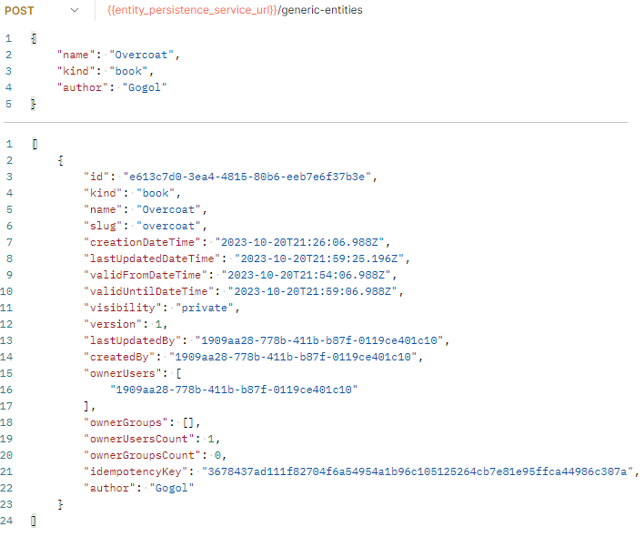

# Entity Persistence Gateway Policies

## Overview

This repository serves as the central policy repository for the **Tarcinapp Entity Persistence Gateway**, containing all **Open Policy Agent (OPA)** policies written in Rego that enforce fine-grained access control across the Tarcinapp API ecosystem.

**Purpose:**
📌 Define authorization rules for all API operations exposed through the `entity-persistence-gateway`
📌 Enforce field-level access control to protect sensitive data and maintain data integrity
📌 Provide consistent, declarative security policies across multiple resource types (entities, lists, relations, reactions)
📌 Integrate seamlessly with the `entity-persistence-service` managed fields architecture (`_ownerUsers`, `_ownerGroups`, `_visibility`, `_validFromDateTime`, `_validUntilDateTime`, etc.)

**Key Capabilities:**
📌 **Operation Authorization:** Determines whether a user is permitted to execute specific operations (create, read, update, delete) on resources
📌 **Field-Level Control:** Restricts which fields users can view, create, or modify based on their roles and permissions
📌 **Ownership & Visibility Management:** Enforces complex access rules based on direct ownership, group ownership, and visibility settings
📌 **Temporal Access Control:** Implements time-based access using validity periods (pending, active, expired states)
📌 **Relational Authorization:** Derives permissions for relational objects from the authorization context of connected resources

**Integration:**
These policies are evaluated by the API Gateway at request time, ensuring that only authorized operations proceed to the backend service. The policies work in concert with JWT token claims (roles, user ID, groups) and resource metadata to make authorization decisions.

## Core Authorization Concepts

This section defines the foundational principles that govern all authorization decisions in the Tarcinapp policy system. Understanding these concepts is essential for interpreting the specific policy implementations.

### 2.1. The Core Philosophy

The authorization model is built on four primary mechanisms that work together to determine access permissions:

#### 1. Roles & Granularity

**Base Roles:**
The system recognizes four hierarchical access levels:
* **`Admin`**: Full administrative access; can perform all operations including sensitive modifications
* **`Editor`**: Elevated privileges for content management; can create and modify resources
* **`Member`**: Standard user access; can interact with resources based on [ownership](#2-ownership) and [visibility rules](#3-visibility)
* **`Visitor`**: Limited read-only access; can view public resources with restrictions

**Three-Tier Granularity:**
Roles can be assigned at multiple scopes to provide flexible access control:

1. **Application-Level**: Applies to all operations across all resource types
   * Example: `tarcinapp.admin` grants admin access to everything
   
2. **Resource-Type Level**: Applies to all operations on a specific resource type
   * Example: `tarcinapp.entities.editor` grants editor access to all entity operations
   * Supported resource types: `entities`, `lists`, `relations`, `entityReactions`, `listReactions`
   * Aliases: `records` (applies to both entities and lists), `reactions` (applies to both entityReactions and listReactions)

3. **Operation-Level**: Applies to specific operations on a resource type
   * Example: `tarcinapp.entities.create.member` allows members to create entities only
   * Operations: `create`, `find`, `update`, `updateall`, `delete`, `count`

**Field-Level Roles:**
Beyond operation access, field-level roles control access to individual fields:
* Format: `tarcinapp.<scope>.fields.<fieldName>.<operation>`
* Operations: `find` (view), `create`, `update`, `manage` (all operations)
* Example: `tarcinapp.entities.fields._visibility.update` allows updating the `_visibility` field

#### 2. Ownership

Resources use two types of ownership to determine who has privileged access:

**Direct Ownership (`_ownerUsers`):**
* An array of user identifiers. A user is considered a direct owner if their unique identifier (the JWT `sub` claim) is **contained** within this array. Direct owners have the highest level of access to their resources.
* Direct ownership takes precedence over all other access mechanisms
* Direct owners can access their resources even in `pending` or `private` states

**Group Ownership (`_ownerGroups`):**
* An array of group identifiers (matching JWT token `groups` claim)
* Provides ownership privileges to members of specified groups
* **Important:** Group ownership is only evaluated when:
  * The user is **not** a direct owner
  * The resource is **not** in `private` visibility state
* Group owners can access resources in `protected` and `public` visibility modes

**Ownership Precedence:**
Direct ownership is always checked first. Group-based permissions are only considered when direct ownership does not apply and [visibility rules](#3-visibility) permit it.

#### 3. Visibility

The `_visibility` field controls who can view and interact with a resource. Three states are supported:

**`private`:**
* Most restrictive visibility mode
* Only accessible to:
  * Direct owners (from `_ownerUsers`)
  * Users explicitly listed in `_viewerUsers` (when resource is active)
  * Users with appropriate admin/editor roles
* Group-based access (`_ownerGroups`, `_viewerGroups`) is **disabled** for private resources

**`protected`:**
* Intermediate visibility mode
* Accessible to:
  * Direct owners and group owners
  * Users/groups listed in `_viewerUsers` / `_viewerGroups` (when active)
  * Users with appropriate roles
* Balances privacy with controlled sharing

**`public`:**
* Most permissive visibility mode
* Accessible to all authenticated users when the resource is in an `active` state
* Still respects temporal validity ([see Activeness](#4-activeness-validity))
* Owners maintain full control (edit, delete, etc.)

**Viewer Lists:**
* `_viewerUsers`: Array of user IDs granted view-only access to active resources
* `_viewerGroups`: Array of group IDs granted view-only access to active, non-private resources

#### 4. Activeness (Validity)

Resources have temporal validity controlled by two timestamp fields:

**Validity Fields:**
* `_validFromDateTime`: ISO 8601 timestamp indicating when the resource becomes active
* `_validUntilDateTime`: ISO 8601 timestamp indicating when the resource expires

**Resource States:**

**`Pending`:**
* `_validFromDateTime` is `null` or in the future
* Resource is not yet active
* Only direct owners and admins can access pending resources
* Useful for scheduled content publication

**`Active`:**
* `_validFromDateTime` is set and in the past
* `_validUntilDateTime` is `null` or in the future
* Resource is currently valid and accessible according to [visibility rules](#3-visibility)
* Standard state for operational resources

**`Expired`:**
* `_validUntilDateTime` is set and in the past
* Resource is no longer active
* Generally inaccessible to non-owners
* Useful for time-limited content (promotions, temporary access, etc.)

**Impact on Authorization:**
* Public visibility requires an [`active` state](#4-activeness-validity) for non-owners
* Viewer access (via `_viewerUsers` / `_viewerGroups`) requires an [`active` state](#4-activeness-validity)
* **Owner access to expired resources:**
  * **Admin and Editor owners** can access their resources in any state (pending, active, expired)
  * **Member owners** are generally **denied** access to their own resources that have passed their `_validUntilDateTime` (expired state)
  * This distinction ensures that only elevated roles can manage or retrieve expired content, while standard members cannot access expired resources even if they own them

### 2.2. The Two Types of Policies

The policy system is divided into two complementary layers that work together to enforce authorization:

#### 1. Operation Authorization Policies

**Purpose:** Determine whether a complete API request should be allowed or denied.

**Location:** `policies/auth/routes/<resource>/<operation>/policy.rego`

**Output:** Boolean decision
* `allow = true`: Request is authorized and proceeds to the backend service
* `allow = false`: Request is denied and returns an HTTP 403 Forbidden response

**Evaluation Logic:**
* Validate JWT token claims (roles, user ID, groups)
* Check resource ownership and visibility (for single-resource operations)
* Verify operation-level permissions
* Enforce field-level restrictions (forbidden fields)
* Apply time-based validity rules

**Examples:**
* [createEntity](./policies/auth/routes/entities/createEntity/README.md): Authorizes entity creation
* [findListById](./policies/auth/routes/lists/findListById/README.md): Authorizes viewing a specific list
* [deleteRelationById](./policies/auth/routes/relations/deleteRelationById/README.md): Authorizes relation deletion

#### 2. Field-Level Policies

**Purpose:** Generate lists of fields that a user is forbidden from viewing, creating, or modifying.

**Location:** `policies/fields/<resource>/policy.rego`

**Output:** Arrays of forbidden field names
* `which_fields_forbidden_for_finding`: Fields to redact from read responses
* `which_fields_forbidden_for_create`: Fields that cannot be set during creation
* `which_fields_forbidden_for_update`: Fields that cannot be modified during updates

**Evaluation Logic:**
* Determine the user's highest role for the resource type
* Retrieve the default forbidden field list for that role
* Check for field-level role exceptions (e.g., `tarcinapp.entities.fields._createdBy.create`)
* Return the effective forbidden fields after applying exceptions

**Core Field-Level Principles:**

The following patterns consistently govern field access across all resource types:

**Admins:**
* **No forbidden fields** across any operation (`find`, `create`, `update`)
* Admins have unrestricted access to all fields including system metadata, audit trails, and ownership information
* This enables full administrative control and troubleshooting capabilities

**Editors:**
* **No restrictions on viewing** (can see all fields)
* **Cannot create or update audit and identity fields:**
  * `_createdDateTime` - Record creation timestamp (system-managed)
  * `_createdBy` - Record creator identifier (system-managed)
  * `_lastUpdatedDateTime` - Last modification timestamp (system-managed)
  * `_lastUpdatedBy` - Last modifier identifier (system-managed)
  * `_idempotencyKey` - Deduplication key (client-managed at creation only)
* **Rationale:** Editors can fully manage content but cannot tamper with audit trails or impersonate other users

**Members:**
* **View restrictions** (cannot see internal system fields):
  * `_version` - Internal versioning metadata
  * `_idempotencyKey` - Deduplication keys
  * `_application` - Internal application identifiers
* **Cannot create:**
  * All audit fields (`_createdDateTime`, `_lastUpdatedDateTime`, `_lastUpdatedBy`, `_createdBy`)
  * Temporal validity fields (`_validFromDateTime`, `_validUntilDateTime`)
  * Ownership assignment (`_ownerUsers`) - prevents privilege escalation
  * Resource-specific immutable fields (`_slug`, `_kind` where applicable)
* **Cannot update:**
  * All audit fields (same as create restrictions)
  * Temporal validity fields (requires special roles to expire/schedule content)
  * Immutable resource identifiers (`_kind`, `_slug`, `_listId`, `_entityId` depending on resource type)
* **Rationale:** Members have standard user privileges with protections against:
  * Privilege escalation (cannot assign themselves as owners)
  * Audit trail manipulation (cannot modify creation/update metadata)
  * Temporal control bypass (cannot schedule or expire content without additional permissions)
  * Resource identity tampering (cannot change fundamental resource properties)

**Visitors:**
* **Most restrictive view permissions** (can only see basic public information)
* **Hidden fields include:**
  * All temporal validity metadata (`_validFromDateTime`, `_validUntilDateTime`)
  * All visibility and access control fields (`_visibility`, `_viewerUsers`, `_viewerGroups`)
  * All audit metadata (`_lastUpdatedBy`, `_lastUpdatedDateTime`)
  * All internal system fields (`_version`, `_idempotencyKey`, `_application`)
* **Rationale:** Visitors should only see public-facing content without exposure to system internals or privacy-sensitive metadata

**Field-Level Role Exceptions:**
Any of the above restrictions can be bypassed by granting explicit field-level roles:
* Format: `tarcinapp.<scope>.fields.<fieldName>.<operation>`
* Example: `tarcinapp.entities.fields._validFromDateTime.create` allows a Member to set validity start time
* Use cases: Scheduled publishing, advanced ownership management, custom audit requirements


**Protected Fields Examples:**
* `_ownerUsers`, `_ownerGroups`: Prevent privilege escalation
* `_createdBy`, `_creationDateTime`: Maintain audit integrity
* `_idempotencyKey`: Prevent duplicate request manipulation
* `_validFromDateTime`, `_validUntilDateTime`: Control temporal validity

**Field-Level Policy References:**

1. [Entities Field Policy](./policies/fields/entities/policy.rego) | [Forbidden Fields Definition](./policies/fields/entities/forbidden_fields.rego)
2. [Lists Field Policy](./policies/fields/lists/policy.rego) | [Forbidden Fields Definition](./policies/fields/lists/forbidden_fields.rego)
3. [Relations Field Policy](./policies/fields/relations/policy.rego) | [Forbidden Fields Definition](./policies/fields/relations/forbidden_fields.rego)
4. [Entity Reactions Field Policy](./policies/fields/entityReactions/policy.rego) | [Forbidden Fields Definition](./policies/fields/entityReactions/forbidden_fields.rego)
5. [List Reactions Field Policy](./policies/fields/listReactions/policy.rego) | [Forbidden Fields Definition](./policies/fields/listReactions/forbidden_fields.rego)

### 2.3. Principles for Relational and Contextual Data

Authorization for operations involving multiple resources or hierarchical relationships requires extended principles beyond single-resource access control.

#### 1. Derived Authorization (Relations)

**Principle:**  
Relation objects (connections between lists and entities) **do not carry their own ownership or visibility metadata**. Instead, authorization is always **derived** from the ownership and visibility of the connected resources.

**Implementation:**
* Relation records reference a source list (`_listId`) and a target entity (`_entityId`)
* The gateway enriches relation operations with metadata from both ends:
  * `_fromMetadata`: Ownership and visibility of the list
  * `_toMetadata`: Ownership and visibility of the entity
* Policies evaluate authorization against **both** metadata objects

**Authorization Rules:**

**Creating a Relation:**
* **Requires:** User must be an **owner** of the list (via `_fromMetadata`) **AND** have **viewability** of the target entity (via `_toMetadata`)
* **Rationale:** Creating a relation means adding an entity to a list. The user must control the list and must be able to see the entity they're adding.

**Viewing a Relation:**
* **Requires:** User must have **viewability** of both the list and the entity
* **Rationale:** Seeing a relation reveals information about both resources, so access to both is required.

**Modifying/Deleting a Relation:**
* **Requires:** User must be an **owner** of the list (the relation belongs to the list's context)
* **Rationale:** Removing or changing a relation is equivalent to managing the list's membership.

**Example Scenario:**
* Alice owns List A and wants to add Entity X to it
* Alice must be able to view Entity X (owned by Bob, but set to `public` or `protected` with Alice as a viewer)
* Bob owns Entity X but cannot create relations in Alice's List A (Bob doesn't own the list)

#### 2. Composite Authorization (Through/Hierarchy)

**Principle:**  
Contextual ("Through") and hierarchical (parent/child) operations are governed by the **intersection** of policies from two separate resources. Both policies must independently authorize the operation (AND logic).

**Contextual Operations (Through):**

Operations that act on one resource in the context of another require authorization from both perspectives:

* **`POST /lists/{listId}/entities`** (create entity through list):
  * Must satisfy the **viewability** policy for the list (user can access the list context)
  * Must satisfy the **creation** policy for entities (user can create entities)
  
* **`GET /entities/{entityId}/lists`** (find lists through entity):
  * Must satisfy the **viewability** policy for the entity
  * Must satisfy the **find** policy for lists

* **`PUT /lists/{listId}/reactions`** (update reactions through list):
  * Must satisfy the **viewability** policy for the list
  * Must satisfy the **update** policy for reactions

**Hierarchical Operations (Parent/Child):**

Operations that create or navigate parent-child relationships within the same resource type:

* **`POST /entities/{parentId}/children`** (create child entity):
  * Must satisfy the **viewability** policy for the parent entity (user can access parent context)
  * Must satisfy the **creation** policy for child entities (user can create entities)
  
* **`GET /entities/{entityId}/children`** (find children):
  * Must satisfy the **viewability** policy for the parent entity
  * Must satisfy the **find** policy for entities (child resources)

* **`GET /entities/{entityId}/parents`** (find parents):
  * Must satisfy the **viewability** policy for the child entity (starting point)
  * Must satisfy the **find** policy for entities (parent resources)

**Rationale:**
* **Security:** Prevents context-based privilege escalation (accessing resources through unauthorized contexts)
* **Consistency:** Maintains authorization semantics regardless of the API path used
* **Clarity:** Each resource type's policies remain independent and reusable

**Example Scenario:**
* User has `tarcinapp.entities.find.member` but not `tarcinapp.lists.find.member`
* User **cannot** execute `GET /entities/{entityId}/lists` even if they own the entity
* Both the entity viewability check and the list find authorization must pass

## Policy Reference by Controller

> This section lists references to the specific policies that define the authorization logic for endpoints. For full details on any policy, please refer to its respective `README.md` file.

### 3.1. Core Resources

#### 3.1.1. Entities Controller (`/entities/`)

* [countEntities](./policies/auth/routes/entities/countEntities/README.md)
* [createEntity](./policies/auth/routes/entities/createEntity/README.md)
* [createEntityChild](./policies/auth/routes/entities/createEntityChild/README.md)
* [deleteEntityById](./policies/auth/routes/entities/deleteEntityById/README.md)
* [findEntities](./policies/auth/routes/entities/findEntities/README.md)
* [findEntityById](./policies/auth/routes/entities/findEntityById/README.md)
* [findEntityChildren](./policies/auth/routes/entities/findEntityChildren/README.md)
* [findEntityParents](./policies/auth/routes/entities/findEntityParents/README.md)
* [replaceEntityById](./policies/auth/routes/entities/replaceEntityById/README.md)
* [updateAllEntities](./policies/auth/routes/entities/updateAllEntities/README.md)
* [updateEntityById](./policies/auth/routes/entities/updateEntityById/README.md)

#### 3.1.2. Lists Controller (`/lists/`)

* [countLists](./policies/auth/routes/lists/countLists/README.md)
* [createList](./policies/auth/routes/lists/createList/README.md)
* [createListChild](./policies/auth/routes/lists/createListChild/README.md)
* [deleteListById](./policies/auth/routes/lists/deleteListById/README.md)
* [findListById](./policies/auth/routes/lists/findListById/README.md)
* [findListChildren](./policies/auth/routes/lists/findListChildren/README.md)
* [findListParents](./policies/auth/routes/lists/findListParents/README.md)
* [findLists](./policies/auth/routes/lists/findLists/README.md)
* [replaceListById](./policies/auth/routes/lists/replaceListById/README.md)
* [updateAllLists](./policies/auth/routes/lists/updateAllLists/README.md)
* [updateListById](./policies/auth/routes/lists/updateListById/README.md)

#### 3.1.3. Relations Controller (`/relations/`)

* [countRelations](./policies/auth/routes/relations/countRelations/README.md)
* [createRelation](./policies/auth/routes/relations/createRelation/README.md)
* [deleteRelationById](./policies/auth/routes/relations/deleteRelationById/README.md)
* [findRelationById](./policies/auth/routes/relations/findRelationById/README.md)
* [findRelations](./policies/auth/routes/relations/findRelations/README.md)
* [replaceRelationById](./policies/auth/routes/relations/replaceRelationById/README.md)
* [updateAllRelations](./policies/auth/routes/relations/updateAllRelations/README.md)
* [updateRelationById](./policies/auth/routes/relations/updateRelationById/README.md)

### 3.2. Through and Contextual Resources

#### 3.2.1. Entity Reactions (`/entityReactions` and `/reactionsThroughEntity`)

* [countEntityReactions](./policies/auth/routes/entityReactions/countEntityReactions/README.md)
* [createEntityReaction](./policies/auth/routes/entityReactions/createEntityReaction/README.md)
* [createChildEntityReaction](./policies/auth/routes/entityReactions/createChildEntityReaction/README.md)
* [deleteEntityReactionById](./policies/auth/routes/entityReactions/deleteEntityReactionById/README.md)
* [findEntityReactionById](./policies/auth/routes/entityReactions/findEntityReactionById/README.md)
* [findEntityReactions](./policies/auth/routes/entityReactions/findEntityReactions/README.md)
* [findChildrenEntityReactionsByReactionId](./policies/auth/routes/entityReactions/findChildrenEntityReactionsByReactionId/README.md)
* [findParentsByEntityReactionId](./policies/auth/routes/entityReactions/findParentsByEntityReactionId/README.md)
* [replaceEntityReactionById](./policies/auth/routes/entityReactions/replaceEntityReactionById/README.md)
* [updateAllEntityReactions](./policies/auth/routes/entityReactions/updateAllEntityReactions/README.md)
* [updateEntityReactionById](./policies/auth/routes/entityReactions/updateEntityReactionById/README.md)
* [createReactionByEntityId](./policies/auth/routes/reactionsThroughEntity/createReactionByEntityId/README.md)
* [deleteReactionsByEntityId](./policies/auth/routes/reactionsThroughEntity/deleteReactionsByEntityId/README.md)
* [findReactionsByEntityId](./policies/auth/routes/reactionsThroughEntity/findReactionsByEntityId/README.md)
* [updateReactionsByEntityId](./policies/auth/routes/reactionsThroughEntity/updateReactionsByEntityId/README.md)

#### 3.2.2. Entities Through List (`/entitiesThroughList`)

* [createEntityByListId](./policies/auth/routes/entitiesThroughList/createEntityByListId/README.md)
* [deleteEntitiesByListId](./policies/auth/routes/entitiesThroughList/deleteEntitiesByListId/README.md)
* [findEntitiesByListId](./policies/auth/routes/entitiesThroughList/findEntitiesByListId/README.md)
* [updateEntitiesByListId](./policies/auth/routes/entitiesThroughList/updateEntitiesByListId/README.md)

#### 3.2.3. Lists Through Entity (`/listsThroughEntity`)

* [findListsByEntityId](./policies/auth/routes/listsThroughEntity/findListsByEntityId/README.md)

#### 3.2.4. List Reactions (`/listReactions` and `/reactionsThroughList`)

* [countListReactions](./policies/auth/routes/listReactions/countListReactions/README.md)
* [createListReaction](./policies/auth/routes/listReactions/createListReaction/README.md)
* [createChildListReaction](./policies/auth/routes/listReactions/createChildListReaction/README.md)
* [deleteListReactionById](./policies/auth/routes/listReactions/deleteListReactionById/README.md)
* [findListReactionById](./policies/auth/routes/listReactions/findListReactionById/README.md)
* [findListReactions](./policies/auth/routes/listReactions/findListReactions/README.md)
* [findChildrenListReactionsByReactionId](./policies/auth/routes/listReactions/findChildrenListReactionsByReactionId/README.md)
* [findParentsByListReactionId](./policies/auth/routes/listReactions/findParentsByListReactionId/README.md)
* [replaceListReactionById](./policies/auth/routes/listReactions/replaceListReactionById/README.md)
* [updateAllListReactions](./policies/auth/routes/listReactions/updateAllListReactions/README.md)
* [updateListReactionById](./policies/auth/routes/listReactions/updateListReactionById/README.md)
* [updateListReactions](./policies/auth/routes/listReactions/updateListReactions/README.md)
* [createReactionByListId](./policies/auth/routes/reactionsThroughList/createReactionByListId/README.md)
* [deleteReactionsByListId](./policies/auth/routes/reactionsThroughList/deleteReactionsByListId/README.md)
* [findReactionsByListId](./policies/auth/routes/reactionsThroughList/findReactionsByListId/README.md)
* [updateReactionsByListId](./policies/auth/routes/reactionsThroughList/updateReactionsByListId/README.md)

## Repository Structure

The repository follows a semantic folder structure that organizes policies by type and resource context:

### Operation Authorization Policies

**Location:** `policies/auth/routes/`

Operation authorization policies are grouped by resource type and operational context:

* **Core Resource Types:**
  * `entities/` - Policies for entity operations (create, find, update, delete, count, parent/child navigation)
  * `lists/` - Policies for list operations (create, find, update, delete, count, parent/child navigation)
  * `relations/` - Policies for relation operations (create, find, update, delete, count)

* **Reaction Resources:**
  * `entityReactions/` - Direct entity reaction operations
  * `listReactions/` - Direct list reaction operations

* **Contextual (Through) Resources:**
  * `reactionsThroughEntity/` - Managing reactions in the context of a specific entity
  * `reactionsThroughList/` - Managing reactions in the context of a specific list
  * `entitiesThroughList/` - Managing entities in the context of a specific list (list membership)
  * `listsThroughEntity/` - Querying lists in the context of a specific entity

Each policy folder contains:
* `policy.rego` - The authorization decision logic
* `metadata.rego` - Policy description and input/output contract
* `policy_test.rego` - Comprehensive unit tests demonstrating expected behavior
* `README.md` - Detailed documentation of the policy's rules and examples

### Field-Level Policies

**Location:** `policies/fields/`

Field-level policies define forbidden fields for each resource type:

* `entities/` - Field restrictions for entity resources
* `lists/` - Field restrictions for list resources
* `relations/` - Field restrictions for relation resources
* `entityReactions/` - Field restrictions for entity reaction resources
* `listReactions/` - Field restrictions for list reaction resources

Each field policy folder contains:
* `forbidden_fields.rego` - Authoritative lists of forbidden fields per role and operation
* `policy.rego` - Helper functions that compute effective forbidden fields after applying exceptions

### Utility Modules

**Location:** `policies/util/`

Shared utility modules provide reusable logic:

* `common/` - Cross-cutting utilities (token parsing, time handling, array operations, verification helpers)
* `entities/` - Entity-specific role matching helpers
* `lists/` - List-specific role matching helpers
* `relations/` - Relation-specific role matching helpers
* `entityReactions/` - Entity reaction-specific role matching helpers
* `listReactions/` - List reaction-specific role matching helpers

## What is Tarcinapp Suite?

The Tarcinapp suite is a comprehensive and flexible application framework, harmoniously blending a suite of interconnected components designed to deliver a seamless and secure microservices architecture. It also provides the flexibility for users to leverage it as an upstream project for their own REST API-based backend implementations, allowing for easy adaptation to their specific requirements and use cases.

<p align="center">
  
</p>

At its core is the **Entity Persistence Service**, an easily adaptable REST-based backend application built on the [Loopback 4](https://loopback.io) framework. This service utilizes a schemaless MongoDB database to provide a scalable and highly adaptable data persistence layer. Offering a generic data model with predefined fields such as `id`, `name`, `kind`, `lastUpdateDateTime`, `creationDateTime`, `ownerUsers` and more, it effortlessly adapts to diverse use cases.

The integration with the **Entity Persistence Gateway** empowers users to implement enhanced validation, authentication, authorization, and rate-limiting functionalities, ensuring a secure and efficient environment. Leveraging the power of **Redis**, the application seamlessly manages distributed locks, enabling robust data synchronization and rate limiting. Furthermore, the ecosystem includes the **Open Policy Agent (OPA)** to enforce policies, safeguarding your application against unauthorized access and ensuring compliance with your security and operational requirements. These policies, combined with the entire suite of components, form a cohesive and powerful ecosystem, paving the way for efficient and secure microservice development.

Here is an example request and response to one of the most basic endpoints: `/entities`:

<p align="left">
  
</p>

**Note:** The client's authorization to create an entity, the fields that user can specify, and the fields returned in the response body may vary based on the user's role. The values of managed fields such as `visibility`, `idempotencyKey`, `validFromDateTime`, and `validUntilDateTime` can also be adjusted according to the user's role and the system's configuration.

**Note:** Endpoints can be configured with arbitrary values within the gateway component. For example, `/books` can be used for records with `kind: book`, and the field `kind` can be completely omitted from the API interaction.

## Development Guide

### High-Level Goals and Principles

This component centralizes authorization and field-level controls for the Tarcinapp Suite. Below are the guiding principles that drive policy design:

* **Single source of truth:** Keep authorization and field-level rules in one place so decisions are consistent across the gateway and services.
* **Owner-first semantics:** Direct owners in `_ownerUsers` take precedence; group and viewer checks are evaluated only when the caller is not a direct owner.
* **Time-driven visibility:** Records can be pending, active, or passive via `_validFromDateTime` and `_validUntilDateTime`; visibility rules depend on these states.
* **Minimal list policies:** The gateway is responsible for narrowing list/find queries according to ownership/visibility; route policies remain lightweight for list endpoints and focus on single-record checks when `originalRecord` is provided.
* **Field-level exceptions:** Field-level roles (e.g., `tarcinapp.entities.fields._createdBy.create`) allow safe exceptions to the default forbidden field lists defined under `policies/fields/*`.

### Field Masking - Forbidden Fields

Field-level rules are primarily a data-masking mechanism that enforces least-privilege at the field level. In plain terms:

* Protect sensitive or system-managed fields from being seen or changed by users who should not have that capability (examples: `_createdBy`, `_idempotencyKey`, `_ownerUsers`, `_validUntilDateTime`).
* For reads (find/find-by-id), the field policy determines which fields must be redacted or omitted for a caller: use `which_fields_forbidden_for_finding` to drive response masking so users only receive permitted data.
* For writes (create/update), the field policy determines which fields callers are not allowed to provide. Route policies reject requests that attempt to set forbidden fields.
* This protects privacy (personal data, ownership lists), preserves audit integrity (creation/update timestamps and authors), and avoids accidental or malicious tampering with lifecycle or identity metadata.

Example: visitors should not see `_ownerUsers` or `_idempotencyKey` and cannot set `_validFromDateTime`; a member may be allowed to see some metadata but still not modify audit fields unless granted explicit field-level roles.

#### Where It's Defined

Each resource keeps an authoritative list under `policies/fields/<resource>/forbidden_fields.rego`. These files declare a `default forbiddenFields` array of objects shaped like:

```rego
{
  "role": "member",
  "operations": {
    "find": [...],
    "create": [...],
    "update": [...]
  }
}
```

#### How the Policy Produces Effective Forbidden Lists

The field policy file `policies/fields/<resource>/policy.rego` exposes three canonical helpers:
* `which_fields_forbidden_for_finding`
* `which_fields_forbidden_for_create`
* `which_fields_forbidden_for_update`

These helpers call `get_fields_for` and `get_effective_fields_for` to merge `find` with `create`/`update` lists where needed and then filter out fields for which the caller has an explicit field-level role by calling the `can_user_*_field` predicates.

#### How Field-Level Role Exceptions Are Matched

Roles follow the pattern: `tarcinapp.<scope>.fields.<fieldName>.<operation>` or `...<fieldName>.manage` for full-field privileges.

**Examples:**
* Entity create exception: `tarcinapp.entities.fields._createdBy.create` or `tarcinapp.records.fields._createdBy.create` (entity helpers accept both `records` and `entities` scopes).
* Relation field exception: `tarcinapp.relations.fields.<fieldName>.create` (relations use the `relations` scope).

The field policy implements predicates such as `can_user_create_field(fieldName)` which check `token.payload.roles` against the expected role pattern and return true when a matching role is present.

#### How Route Policies Enforce Forbidden Fields

Route policies import the corresponding field policy (for example `import data.policies.fields.entities.policy as forbidden_fields`) and reject payloads that include any forbidden field using a helper like `payload_contains_any_field`:

```rego
not payload_contains_any_field(forbidden_fields.which_fields_forbidden_for_create)
```

See `policies/auth/routes/entities/createEntity/policy.rego` and `policies/auth/routes/relations/createRelation/policy.rego` for canonical usage.

#### How to Grant an Exception (Practical Steps)

1. Add the field-level role to the user's token (or configure it in Keycloak). Example role: `tarcinapp.entities.fields._createdBy.create`.
2. In tests, use the helper `produce_input_doc_by_role_with_field_permission` to append the field-level role to the token roles array.
3. Assert that the field is no longer returned by `forbidden_fields.which_fields_forbidden_for_create` and that the route policy allows payloads that include the field.

#### Common Pitfalls and Troubleshooting

* Wrong scope in role name (use `records|entities` for entity fields, `relations` for relation fields).
* Missing or wrong `input.appShortcode` — the field predicates use `input.appShortcode` when constructing the expected role pattern.
* Token roles not present at `token.payload.roles` (ensure Keycloak role mappers are configured to place roles under `roles` in the token payload).

### Ownership & Viewership

This project uses a clear, deterministic ownership and viewership model to decide who may see or operate on a record. The rules are applied consistently across entities, lists and relations (relations use the referenced records' metadata).

#### What Counts as an Owner

* **Direct owner:** Any identifier listed in the record's `_ownerUsers` array that matches the requester's token `sub` claim.
* **Group owner:** Any group listed in the record's `_ownerGroups` array that matches any group in the requester's token `groups` claim. Group ownership is only considered when the requester is not a direct owner.

#### Time/State Semantics

* **Pending:** `_validFromDateTime` is null (record is not active yet). Direct owners (regardless of role) may still see pending records.
* **Active:** `_validFromDateTime` is set and in the past, and `_validUntilDateTime` is null or in the future.
* **Passive (expired):** `_validUntilDateTime` is set and in the past. Expired records are inaccessible:
  * **Member owners** cannot access their own expired records
  * **Admin and Editor owners** can access expired records they own
  * Non-owners cannot access expired records

#### Visibility Values

* **`public`:** Visible to public, subject to `active` state when applicable.
* **`protected`:** Visible to owners and group/viewer-based controls when the record is not `private` and is active.
* **`private`:** Restricted — only direct owners (and certain admin/editor roles) may see private records; group-based viewer/owner checks do not permit access.

#### Viewer Semantics

* **Viewer user:** If the requester's `sub` is listed in the record's `_viewerUsers` and the record is active, the requester may see the record (this includes private records if active).
* **Viewer group:** If any of the requester's groups is in the record's `_viewerGroups` and the record is active and not `private`, the requester may see the record.

#### Decision Precedence (Applied in Order)

**For Admin and Editor roles:**
* Admin and Editor users with appropriate operation-level permissions can access resources regardless of ownership, visibility, or temporal state (including expired resources)

**For Member role (standard users):**
1. If requester's id is in `_ownerUsers` and record is not passive (expired) => allowed.
2. Else if requester's groups intersect `_ownerGroups` and record is not passive and not `private` => allowed.
3. Else if record is `public` and active => allowed.
4. Else if requester's id is in `_viewerUsers` and record is active => allowed.
5. Else if requester's groups intersect `_viewerGroups` and record is active and not `private` => allowed.
6. Otherwise => denied.

**Key distinction:** Member owners cannot access their own expired resources, while Admin and Editor owners can.

#### Relation Endpoints

Relations themselves do not carry ownership/viewer fields. For single-relation endpoints (create/replace/find-by-id) policies rely on `originalRecord` containing `_fromMetadata` and `_toMetadata` and require the caller to be able to see both the source and the target. For list queries (`findRelations`) the gateway must shape the query so that returned relations already match caller visibility constraints.

#### Implementation Note

Rego helpers are provided under `policies/util/common/originalRecord.rego` and can be reused via `with input as {"originalRecord": meta}` to avoid duplicating time/visibility logic.

### Implementation Patterns and Structure

* **Routes:** Each route under `policies/auth/routes/<route>` contains:
  * `policy.rego` — the route's decision logic
  * `metadata.rego` — a short description and the policy's input/field contract
  * `policy_test.rego` — unit tests showing expected behavior
* **Common utilities:** Shared helpers are under `policies/util` (token, verification, time/parse helpers, originalRecord helpers, role matchers, arrays). Reuse these helpers across route policies.
* **Field policies:** `policies/fields/<resource>/policy.rego` describe forbidden fields per role and operation and are consulted by route policies to enforce field-level constraints.
* **Roles:** Role matching helpers implement multi-scope patterns (app-wide, records-wide, resource-scoped, and operation-specific variants) so a caller can be granted permissions at multiple levels.

### Relation-Specific Notes

Relations do not carry owners/viewers themselves; instead, decision logic for relation endpoints must inspect both ends:
* `_fromMetadata`: metadata of the referenced list (source)
* `_toMetadata`: metadata of the referenced entity (target)

For a caller to access a single relation, the policy must ensure the caller can see both the source and the target. That is why single-relation endpoints (create/replace/find-by-id) receive or consult `originalRecord` that includes both `_fromMetadata` and `_toMetadata`.

For list find endpoints (e.g., `findRelations`) the gateway is expected to provide proper query constraints so the policy can remain minimal and efficient.

### Policy Execution Input (Relations-Aware)

All OPA policies in this repository receive a standardized JSON input document that describes the HTTP request, authentication context, and resource state. This input structure is **critical** for writing and testing policies effectively.

#### Complete Input Structure

The following JSON structure represents the complete input passed to the OPA policy engine:

```json
{
  "policyName": "/policies/auth/routes/<resource>/<operation>/policy",
  "appShortcode": "tarcinapp",
  "httpMethod": "GET|POST|PUT|PATCH|DELETE",
  "requestPath": "/<resource>/{id}",
  "queryParams": {
    "filter": {},
    "sort": {},
    "limit": 100,
    "offset": 0
  },
  "encodedJwt": "eyJhbGciOiJSUzI1NiIsInR5cCI6IkpXVCJ9...",
  "requestPayload": {
    "name": "Example Resource",
    "_ownerUsers": ["user-id-1"],
    "_ownerGroups": ["group-id-1"],
    "_visibility": "protected",
    "_validFromDateTime": "2025-01-01T00:00:00.000Z",
    "_validUntilDateTime": null
  },
  "originalRecord": {
    "id": "resource-id",
    "name": "Existing Resource",
    "_ownerUsers": ["user-id-1"],
    "_ownerGroups": ["group-id-1"],
    "_visibility": "protected",
    "_validFromDateTime": "2025-01-01T00:00:00.000Z",
    "_validUntilDateTime": null,
    "_creationDateTime": "2025-01-01T00:00:00.000Z",
    "_lastUpdateDateTime": "2025-01-05T12:00:00.000Z",
    "_createdBy": "user-id-1"
  }
}
```

#### Field Descriptions

**Top-Level Fields (Always Present):**

| Field | Type | Required | Description |
|-------|------|----------|-------------|
| `policyName` | String | Yes | Fully qualified path to the policy being evaluated (e.g., `/policies/auth/routes/entities/createEntity/policy`) |
| `appShortcode` | String | Yes | Application identifier used for role matching (e.g., `tarcinapp`) |
| `httpMethod` | String | Yes | HTTP verb of the request: `GET`, `POST`, `PUT`, `PATCH`, `DELETE` |
| `requestPath` | String | Yes | URL path of the API request, may include resource IDs (e.g., `/entities/123` or `/lists/456/entities`) |
| `queryParams` | Object | No | Query parameters for list/find operations (e.g., `filter`, `sort`, `limit`, `offset`). Empty object `{}` for non-list operations |
| `encodedJwt` | String | Yes | **Base64-encoded JWT token** containing user authentication and authorization claims (roles, sub, groups, etc.) |
| `requestPayload` | Object | No | Request body for create/update/replace operations. `null` or absent for read/delete operations |
| `originalRecord` | Object | No | **Existing resource state** for single-record operations (find-by-id, update, replace, delete). Absent for list operations and creation |

#### Special Case: Relation Operations with Metadata Enrichment

**IMPORTANT:** For relation-based operations, the `originalRecord` field is **enriched by the gateway** with metadata from both connected resources. This is essential for implementing derived authorization.

**Relation Input Structure:**

```json
{
  "policyName": "/policies/auth/routes/relations/replaceRelationById/policy",
  "appShortcode": "tarcinapp",
  "httpMethod": "PUT",
  "requestPath": "/relations/rel-123",
  "encodedJwt": "eyJhbGciOiJSUzI1NiIsInR5cCI6IkpXVCJ9...",
  "requestPayload": {
    "_listId": "list-456",
    "_entityId": "entity-789"
  },
  "originalRecord": {
    "id": "rel-123",
    "_listId": "list-456",
    "_entityId": "entity-789",
    "_creationDateTime": "2025-01-01T00:00:00.000Z",
    "_lastUpdateDateTime": "2025-01-05T12:00:00.000Z",
    "_fromMetadata": {
      "id": "list-456",
      "name": "My Favorite Books",
      "_ownerUsers": ["user-alice"],
      "_ownerGroups": ["editors-group"],
      "_visibility": "protected",
      "_validFromDateTime": "2025-01-01T00:00:00.000Z",
      "_validUntilDateTime": null
    },
    "_toMetadata": {
      "id": "entity-789",
      "name": "The Great Gatsby",
      "_ownerUsers": ["user-bob"],
      "_ownerGroups": ["authors-group"],
      "_visibility": "public",
      "_validFromDateTime": "2025-01-01T00:00:00.000Z",
      "_validUntilDateTime": null
    }
  }
}
```

**Key Points for Relation Metadata:**

* **`_fromMetadata`**: Contains the **complete ownership and visibility metadata** of the source list (the "from" side of the relation)
* **`_toMetadata`**: Contains the **complete ownership and visibility metadata** of the target entity (the "to" side of the relation)
* Policies **MUST** evaluate both metadata objects to implement proper derived authorization
* Both metadata objects include all fields necessary for ownership checks (`_ownerUsers`, `_ownerGroups`), visibility checks (`_visibility`, `_viewerUsers`, `_viewerGroups`), and temporal validity checks (`_validFromDateTime`, `_validUntilDateTime`)

#### Usage in Policy Tests

When writing policy tests (`policy_test.rego`), construct input documents following this exact structure:

```rego
# Example: Test relation creation with proper metadata
test_create_relation_allowed_when_user_owns_list_and_can_view_entity {
    allow with input as {
        "policyName": "/policies/auth/routes/relations/createRelation/policy",
        "appShortcode": "tarcinapp",
        "httpMethod": "POST",
        "requestPath": "/relations",
        "encodedJwt": base64.encode(json.marshal(test_token)),
        "requestPayload": {
            "_listId": "list-123",
            "_entityId": "entity-456"
        },
        "originalRecord": {
            "_fromMetadata": {
                "_ownerUsers": ["test-user-id"],
                "_visibility": "protected",
                "_validFromDateTime": "2025-01-01T00:00:00.000Z",
                "_validUntilDateTime": null
            },
            "_toMetadata": {
                "_ownerUsers": ["other-user-id"],
                "_visibility": "public",
                "_validFromDateTime": "2025-01-01T00:00:00.000Z",
                "_validUntilDateTime": null
            }
        }
    }
}
```

#### List Operations vs. Single-Record Operations

**List Operations** (e.g., `findEntities`, `findRelations`, `countLists`):
* **Do NOT receive** `originalRecord` field
* Gateway is responsible for shaping queries based on ownership/visibility constraints
* Policies primarily validate that the user has the appropriate role for the operation

**Single-Record Operations** (e.g., `findEntityById`, `updateListById`, `deleteRelationById`):
* **Always receive** `originalRecord` with complete resource state
* Policies evaluate ownership, visibility, and validity against `originalRecord`
* For relations, `originalRecord` includes enriched `_fromMetadata` and `_toMetadata`

**Note:** Understanding this input structure is essential for both policy development and integration with the gateway. The gateway is responsible for constructing this input correctly before invoking the OPA policy engine.

### How to Read Individual Policy READMEs

Each route has its own README at `policies/auth/routes/<route>/README.md` explaining the semantic differences and specific checks applied (for example how `createRelation` validates the referenced list and target entity via `_fromMetadata`/`_toMetadata`).

## Setting Up the Development Environment

Get the OPA extension for Visual Studio Code (VSCode). This extension simplifies local OPA policy testing by automatically downloading and installing the OPA binary. It's a handy tool to ensure your policies work smoothly within your development environment, enhancing security and compliance for your applications.

### Sample Policy Input

Policy input is a JSON file in the following structure:

```json
{
    "httpMethod": "GET",
    "requestPath": "/entities",
    "queryParams": {},
    "encodedJwt": "eyJhbGciOiJSUzI1NiIsInR5cCIgOiAiSldUIiwia2lkIiA6ICJ1ZGtwaElQVFB1X0tpb28zWWlxYnFESS1IYlpVVWZieHVpMFRuWjRmanVnIn0.eyJleHAiOjE2OTEzMzA2OTYsImlhdCI6MTY5MTMzMDM5NiwianRpIjoiYWY4ZmMyZDctMjczOS00ZGYzLThhMTItMzkwMzVmZTY2YzM1IiwiaXNzIjoiaHR0cHM6Ly90YXJjaW5hcHAtaWRtLWtleWNsb2FrLnRvdjNxbS5lYXN5cGFuZWwuaG9zdC9yZWFsbXMvdGFyY2luYXBwIiwiYXVkIjoiYWNjb3VudCIsInN1YiI6IjczMGVjODg2LThhN2YtNGZlNS04OTZkLWJjNWY0YzgyODE2MyIsInR5cCI6IkJlYXJlciIsImF6cCI6InBvc3RtYW4iLCJzZXNzaW9uX3N0YXRlIjoiMGQwYTUxY2UtMDkzMC00MGU5LWFkMjgtMWRlMWU0ZWNkZTdhIiwiYWNyIjoiMSIsImFsbG93ZWQtb3JpZ2lucyI6WyJodHRwczovL3d3dy5nZXRwb3N0bWFuLmNvbSJdLCJyZWFsbV9hY2Nlc3MiOnsicm9sZXMiOlsiZGVmYXVsdC1yb2xlcy10YXJjaW5hcHAiLCJvZmZsaW5lX2FjY2VzcyIsInVtYV9hdXRob3JpemF0aW9uIiwidGFyY2luYXBwLm1lbWJlciJdfSwicmVzb3VyY2VfYWNjZXNzIjp7ImFjY291bnQiOnsicm9sZXMiOlsibWFuYWdlLWFjY291bnQiLCJtYW5hZ2UtYWNjb3VudC1saW5rcyIsInZpZXctcHJvZmlsZSJdfX0sInNjb3BlIjoib3BlbmlkIHByb2ZpbGUgZW1haWwiLCJzaWQiOiIwZDBhNTFjZS0wOTMwLTQwZTktYWQyOC0xZGUxZTRlY2RlN2EiLCJlbWFpbF92ZXJpZmllZCI6dHJ1ZSwibmFtZSI6Ikt1cnNhdCBUb2twdW5hciIsInByZWZlcnJlZF91c2VybmFtZSI6Imt1cnNhdHRva3BpbmFyIiwiZ2l2ZW5fbmFtZSI6Ikt1cnNhdCIsImZhbWlseV9uYW1lIjoiVG9rcHVuYXIiLCJlbWFpbCI6Imt1cnNhdHRva3BpbmFyQGdtYWlsLmNvbSJ9.nHBtP1-dLpjHWeCCB8FBaVNA4htYH0_BKBm6vB_rNS_a2e8xC_qQ2OtBogQsY42gd1S9d763a84OBWr3iF_pzJElMRuvdexXwQpu8eQ5YzvZyLrVeVGovM-Ep-EeeHRao0zj_92_E6SvlwBwqhNhXBdZ5Q6qLJuIuAxRfz_QMG4F67usuP4Fmmjw6fHddaJXJaLI8yKR5gOP1sPDpoS-acf1SRJipeuZzdbuEHvr5n9dP5YN8uD4_7DWa7A9zcM-2Z1jW3ij7USIugn7xxX4uschUFQQ6B48IxG145gq8N1MuVddQIvb5jOkRYuvjw_s3kXxfA1s3CI7JrEoCUffrA",
    "requestPayload": {
        "_name": "Believe Yourself!",
        "author": "J. Martin Doe",
      "_ownerUsers": ["ebe92b0c-bda2-49d0-99d0-feb538aa7db6"],
      "_ownerGroups":["group-1"],
      "_validFromDateTime": "2019-10-12T07:20:50.52Z",
      "_validUntilDateTime": null
    },
    "originalRecord": {
        "_id": "0331c4d7-1408-4078-8e92-5169a55a12c5",
        "_kind": "book",
        "_name": "Believe Yourself!",
        "author": "J. Doe",
        "_visibility": "private",
        "_ownerUsers": ["ebe92b0c-bda2-49d0-99d0-feb538aa7db6"],
        "_ownerGroups":["group-1"],
        "_validFromDateTime": "2019-10-12T07:20:50.52Z",
        "_validUntilDateTime": null
    }
}
```

## Role Structure in Tarcinapp

Tarcinapp supports a flexible, fine-grained role system that governs access across resources and fields. Roles are defined using a consistent naming convention that allows system administrators to grant permissions at both operation and field levels.

### Role Name Prefix (`tarcinapp.`)

Each role begins with an application-specific prefix, such as `tarcinapp.`. This prefix is a configurable application short code, designed to support scenarios where a single user may have different roles across multiple Tarcinapp instances.

### Operation-Level Roles

These roles control access to operations on resources such as entities, lists and reactions.

**Format:**
```
<app-code>[.<scope>][.<operation>].<level>
```

* **app-code**: Application-specific prefix (e.g., `tarcinapp`)
* **scope**: Resource domain. If not specified in the role name, it means that the role is valid for all scopes.  
  Examples: `records`, `entities`, `lists`, `relations`, `entity-reactions`, `list-reactions`
* **operation**: (optional) Operation being granted  
  Examples: `create`, `update`, `updateall`, `find`, `count`, `delete`  
  If omitted, the role grants all operations under the scope.
* **level**: Access tier  
  Examples: `admin`, `editor`, `member`, `visitor`

**Examples:**

| Role | Meaning |
|------|---------|
| `tarcinapp.admin` | Admin access to all operations |
| `tarcinapp.records.admin` | Admin access to all record operations |
| `tarcinapp.entities.create.editor` | Editor can create entities |
| `tarcinapp.lists.find.member` | Member can query (read) lists |
| `tarcinapp.reactions.delete.admin` | Admin can delete reactions |

### Field-Level Roles

These roles allow precise control over access to individual fields within records.

**Format:**
```
<app-code>[.<scope>].fields.<fieldname>.<operation>
```

* **app-code**: Application-specific prefix (e.g., `tarcinapp`)
* **scope**: Resource domain (same as above)
* **fieldname**: Name of the field (e.g., `_visibility`, `_createdDateTime`)
* **operation**:  
  Options: `find`, `create`, `update`, `manage`  
  `manage` grants all permissions on the field.

**Examples:**

| Role | Meaning |
|------|---------|
| `tarcinapp.entities.fields._visibility.find` | Can read the `_visibility` field of entities |
| `tarcinapp.records.fields._createdDateTime.update` | Can update `_createdDateTime` on records |
| `tarcinapp.lists.fields._viewerGroups.manage` | Full access to `_viewerGroups` field on lists |

### Design Benefits

* **Consistency:** Predictable structure makes it easy to understand and manage
* **Modularity:** Different scopes for different resource types
* **Flexibility:** Field-level and operation-level access can be independently controlled
* **Multi-Tenant Ready:** Role prefix allows isolation across Tarcinapp instances

## Structuring the JWT Token (Keycloak Guide)

Policies within entity-persistence-policies search for the `roles` field within the JWT token, specifically under the `payload` section. However, in the default configuration of Keycloak, the roles are nested under `realm_access.roles`. To align them with the `payload` section, you must create a custom 'Role Mapper' in Keycloak. This mapper allows you to restructure the JWT token during the token issuance process. Here's how to do it:

1. Log in to your Keycloak admin console.
2. Choose the desired realm from the top-left drop-down menu.
3. Navigate to 'Clients' in the left-hand menu and select your client.
4. Access the 'Dedicated Scopes' tab.
5. Click on the {client-name}-dedicated.
6. Go to the 'Mappers' tab.
7. Click 'Add mappers.'
8. Select 'By Configuration.'
   * **Name:** Provide a clear name for your mapper (e.g., 'Realm Role Mapper').
   * **Mapper Type:** Choose 'User Realm Role.'
   * **Token Claim Name:** Set it to your desired name for roles in the payload (e.g., 'roles').
   * **Multivalued:** Select 'ON.'
   * Keep other settings as they are or adjust them based on your specific needs.
9. Click 'Save' to save the mapper.

Now, when a user logs in and requests an access token, the custom mapper will come into effect, moving the roles directly under the `payload` section with the key `roles`.