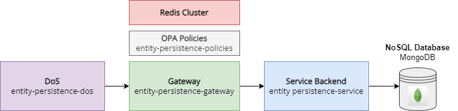

# Overview
The **Entity Persistence Policies** component is a layer within the **Tarcinapp Suite**, designed to enhance the security and fine-grained control of REST-based flows exposed using entity-persistence-gateway. Built upon the Open Policy Agent (OPA) framework and containerized for seamless integration, this component empowers gateway application with the ability to enforce complex policies that determine user actions and field-level access.  
This application seamlessly integrates with the Tarcinapp Suite's managed fields, ensuring efficient policy enforcement for fields like `ownerUsers`, `ownerGroups`, `visibility`, `validFromDateTime`, `validUntilDateTime`, etc..  

**Key Features**  
**User Action Policies**: Entity Persistence Policies enables you to define granular policies that govern user actions within your application. These policies help answer questions like "Can a user perform a specific action?" or "Is this user authorized to execute this operation?".  
  
**Field-Level Access Policies**: With Entity Persistence Policies, you can finely control access to fields in your data model. You have the flexibility to set policies that dictate whether a user can view, create, or update a particular field, providing a data security layer for your application.  
  
By leveraging the power of OPA-based policies, admins and developers ensure that the Tarcinapp application is shielded from unauthorized access, while simultaneously simplifying the enforcement of complex authorization rules. This component helps you reduce development time, enhance security, and streamline the creation of efficient and productive REST-based applications.

## What is Tarcinapp Suite?

The Tarcinapp suite is a comprehensive and flexible application framework, harmoniously blending a suite of interconnected components designed to deliver a seamless and secure microservices architecture. It also provides the flexibility for users to leverage it as an upstream project for their own REST API-based backend implementations, allowing for easy adaptation to their specific requirements and use cases.

<p align="center">
  
</p>

At its core is the **Entity Persistence Service**, an easily adaptable REST-based backend application built on the [Loopback 4](https://loopback.io) framework. This service utilizes on a schemaless MongoDB database to provide a scalable and highly adaptable data persistence layer. Offering a generic data model with predefined fields such as `id`, `name`,  `kind`, `lastUpdateDateTime`, `creationDateTime`, `ownerUsers` and [more](#programming-conventions), it effortlessly adapts to diverse use cases.  

The integration with the **Entity Persistence Gateway** empowers users to implement enhanced validation, authentication, authorization, and rate-limiting functionalities, ensuring a secure and efficient environment. Leveraging the power of **Redis**, the application seamlessly manages distributed locks, enabling robust data synchronization and rate limiting. Furthermore, the ecosystem includes the **Open Policy Agent (OPA)** to enforce policies, safeguarding your application against unauthorized access and ensuring compliance with your security and operational requirements. These policies, combined with the entire suite of components, form a cohesive and powerful ecosystem, paving the way for efficient and secure microservice development.  
Here is an example request and response to the one of the most basic endpoint: `/entities`:
<p align="left">
  
</p>  

**Note:** The client's authorization to create an entity, the fields that user can specify, and the fields returned in the response body may vary based on the user's role. The values of managed fields such as `visibility`, `idempotencyKey`, `validFromDateTime`, and `validUntilDateTime` can also be adjusted according to the user's role and the system's configuration.  
  
**Note**: Endpoints can be configured with arbitrary values within the gateway component. For example, `/books` can be used for records with `kind: book`, and the field `kind` can be completely omitted from the API interaction.

# Entity Persistence Policies Application in Detail

This component centralizes authorization and field-level controls for the Tarcinapp Suite. Below we explain the high-level goals, the core principles that drive policy design, and how individual route policies are implemented and organized.

## High-level goal and principles
- Single source of truth: keep authorization and field-level rules in one place so decisions are consistent across the gateway and services.
- Owner-first semantics: direct owners in `_ownerUsers` take precedence; group and viewer checks are evaluated only when the caller is not a direct owner.
- Time-driven visibility: records can be pending, active, or passive via `_validFromDateTime` and `_validUntilDateTime`; visibility rules depend on these states.
- Minimal list policies: the gateway is responsible for narrowing list/find queries according to ownership/visibility; route policies remain lightweight for list endpoints and focus on single-record checks when `originalRecord` is provided.
- Field-level exceptions: field-level roles (e.g., `tarcinapp.entities.fields._createdBy.create`) allow safe exceptions to the default forbidden field lists defined under `policies/fields/*`.

### Field Masking - Forbidden Fields

Field-level rules are primarily a data-masking mechanism that enforces least-privilege at the field level. In plain terms:

- Protect sensitive or system-managed fields from being seen or changed by users who should not have that capability (examples: `_createdBy`, `_idempotencyKey`, `_ownerUsers`, `_validUntilDateTime`).
- For reads (find/find-by-id), the field policy determines which fields must be redacted or omitted for a caller: use `which_fields_forbidden_for_finding` to drive response masking so users only receive permitted data.
- For writes (create/update), the field policy determines which fields callers are not allowed to provide. Route policies reject requests that attempt to set forbidden fields.
- This protects privacy (personal data, ownership lists), preserves audit integrity (creation/update timestamps and authors), and avoids accidental or malicious tampering with lifecycle or identity metadata.

Example: visitors should not see `_ownerUsers` or `_idempotencyKey` and cannot set `_validFromDateTime`; a member may be allowed to see some metadata but still not modify audit fields unless granted explicit field-level roles.

- Where it's defined
  - Each resource keeps an authoritative list under `policies/fields/<resource>/forbidden_fields.rego`. These files declare a `default forbiddenFields` array of objects shaped like:

    {
      "role": "member",
      "operations": {
        "find": [...],
        "create": [...],
        "update": [...]
      }
    }

- How the policy produces the effective forbidden lists
  - The field policy file `policies/fields/<resource>/policy.rego` exposes three canonical helpers:
    - `which_fields_forbidden_for_finding`
    - `which_fields_forbidden_for_create`
    - `which_fields_forbidden_for_update`
  - These helpers call `get_fields_for` and `get_effective_fields_for` to merge `find` with `create`/`update` lists where needed and then filter out fields for which the caller has an explicit field-level role by calling the `can_user_*_field` predicates.

- How field-level role exceptions are matched
  - Roles follow the pattern: `tarcinapp.<scope>.fields.<fieldName>.<operation>` or `...<fieldName>.manage` for full-field privileges.
  - Examples:
    - Entity create exception: `tarcinapp.entities.fields._createdBy.create` or `tarcinapp.records.fields._createdBy.create` (entity helpers accept both `records` and `entities` scopes).
    - Relation field exception: `tarcinapp.relations.fields.<fieldName>.create` (relations use the `relations` scope).
  - The field policy implements predicates such as `can_user_create_field(fieldName)` which check `token.payload.roles` against the expected role pattern and return true when a matching role is present.

- How route policies enforce forbidden fields
  - Route policies import the corresponding field policy (for example `import data.policies.fields.entities.policy as forbidden_fields`) and reject payloads that include any forbidden field using a helper like `payload_contains_any_field`:
    - `not payload_contains_any_field(forbidden_fields.which_fields_forbidden_for_create)`
  - See `policies/auth/routes/createEntity/policy.rego` and `policies/auth/routes/createRelation/policy.rego` for canonical usage.

- How to grant an exception (practical steps)
  1. Add the field-level role to the user's token (or configure it in Keycloak). Example role: `tarcinapp.entities.fields._createdBy.create`.
  2. In tests, use the helper `produce_input_doc_by_role_with_field_permission` to append the field-level role to the token roles array.
  3. Assert that the field is no longer returned by `forbidden_fields.which_fields_forbidden_for_create` and that the route policy allows payloads that include the field.

- Common pitfalls and troubleshooting
  - Wrong scope in role name (use `records|entities` for entity fields, `relations` for relation fields).
  - Missing or wrong `input.appShortcode` — the field predicates use `input.appShortcode` when constructing the expected role pattern.
  - Token roles not present at `token.payload.roles` (ensure Keycloak role mappers are configured to place roles under `roles` in the token payload).

## Ownership & Viewership

This project uses a clear, deterministic ownership and viewership model to decide who may see or operate on a record. The rules are applied consistently across entities, lists and relations (relations use the referenced records' metadata).

- What counts as an owner
  - Direct owner: any identifier listed in the record's `_ownerUsers` array that matches the requester's token `sub` claim.
  - Group owner: any group listed in the record's `_ownerGroups` array that matches any group in the requester's token `groups` claim. Group ownership is only considered when the requester is not a direct owner.

- Time/state semantics
  - Pending: `_validFromDateTime` is null (record is not active yet). Direct owners may still see pending records.
  - Active: `_validFromDateTime` is set and in the past, and `_validUntilDateTime` is null or in the future.
  - Passive (inactive): `_validUntilDateTime` is set and in the past. Passive records are treated as non-viewable for most non-admin operations.

- Visibility values
  - `public`: visible to public, subject to `active` state when applicable.
  - `protected`: visible to owners and group/viewer-based controls when the record is not `private` and is active.
  - `private`: restricted — only direct owners (and certain admin/editor roles) may see private records; group-based viewer/owner checks do not permit access.

- Viewer semantics
  - Viewer user: if the requester's `sub` is listed in the record's `_viewerUsers` and the record is active, the requester may see the record (this includes private records if active).
  - Viewer group: if any of the requester's groups is in the record's `_viewerGroups` and the record is active and not `private`, the requester may see the record.

- Decision precedence (applied in order)
  1. If requester's id is in `_ownerUsers` and record is not passive => allowed.
  2. Else if requester's groups intersect `_ownerGroups` and record is not passive and not `private` => allowed.
  3. Else if record is `public` and active => allowed.
  4. Else if requester's id is in `_viewerUsers` and record is active => allowed.
  5. Else if requester's groups intersect `_viewerGroups` and record is active and not `private` => allowed.
  6. Otherwise => denied.

- Relation endpoints
  - Relations themselves do not carry ownership/viewer fields. For single-relation endpoints (create/replace/find-by-id) policies rely on `originalRecord` containing `_fromMetadata` and `_toMetadata` and require the caller to be able to see both the source and the target. For list queries (`findRelations`) the gateway must shape the query so that returned relations already match caller visibility constraints.

- Implementation note
  - Rego helpers are provided under `policies/util/common/originalRecord.rego` and can be reused via `with input as {"originalRecord": meta}` to avoid duplicating time/visibility logic.

## Implementation patterns and structure
- Routes: each route under `policies/auth/routes/<route>` contains:
  - `policy.rego` — the route's decision logic
  - `metadata.rego` — a short description and the policy's input/field contract
  - `policy_test.rego` — unit tests showing expected behavior
- Common utilities: shared helpers are under `policies/util` (token, verification, time/parse helpers, originalRecord helpers, role matchers, arrays). Reuse these helpers across route policies.
- Field policies: `policies/fields/<resource>/policy.rego` describe forbidden fields per role and operation and are consulted by route policies to enforce field-level constraints.
- Roles: role matching helpers implement multi-scope patterns (app-wide, records-wide, resource-scoped, and operation-specific variants) so a caller can be granted permissions at multiple levels.

## Relation-specific notes
- Relations do not carry owners/viewers themselves; instead, decision logic for relation endpoints must inspect both ends:
  - `_fromMetadata`: metadata of the referenced list (source)
  - `_toMetadata`: metadata of the referenced entity (target)
- For a caller to access a single relation, the policy must ensure the caller can see both the source and the target. That is why single-relation endpoints (create/replace/find-by-id) receive or consult `originalRecord` that includes both `_fromMetadata` and `_toMetadata`.
- For list find endpoints (e.g., `findRelations`) the gateway is expected to provide proper query constraints so the policy can remain minimal and efficient.

## Policy execution input (relations-aware)
Policies receive JSON input describing the request and context. Common fields:

- `policyName`: path to the policy being executed (e.g., `/policies/auth/routes/replaceRelationById/policy`).
- `appShortcode`: application shortcode (e.g., `tarcinapp`).
- `httpMethod`: HTTP verb (`GET`, `POST`, `PUT`, `PATCH`, etc.).
- `requestPath`: resource path (may contain ids for single-record operations).
- `queryParams`: query parameters for list/find requests.
- `encodedJwt`: caller's encoded JWT.
- `requestPayload`: request body (create/replace/update payloads).
- `originalRecord`: for single-record operations this holds the existing record. For relation-specific operations `originalRecord` contains both `_fromMetadata` and `_toMetadata` (so policies can evaluate source/target ownership and visibility).

Example: a replace relation payload includes nested metadata
```json
{
  "policyName": "/policies/auth/routes/replaceRelationById/policy",
  "appShortcode": "tarcinapp",
  "httpMethod": "PUT",
  "requestPath": "/relations/RELATION_ID",
  "encodedJwt": "...",
  "requestPayload": { "_listId": "LIST_ID", "_entityId": "ENTITY_ID" },
  "originalRecord": {
    "id": "RELATION_ID",
    "_listId": "LIST_ID",
    "_entityId": "ENTITY_ID",
    "_fromMetadata": { /* list metadata */ },
    "_toMetadata": { /* entity metadata */ }
  }
}
```

Note: `findRelations` is a list operation — the gateway should shape queries in such a way that returned items already match visibility/ownership constraints; per-item `originalRecord` entries are not passed to the list-level policy.

## How to read individual policy READMEs
Each route has its own README at `policies/auth/routes/<route>/README.md` explaining the semantic differences and specific checks applied (for example how `createRelation` validates the referenced list and target entity via `_fromMetadata`/`_toMetadata`). See the Policies list below for links to the route READMEs.


# Policies
To access the details of each policy, you can refer to the policy's README.
1. [countEntities](./policies/auth/routes/countEntities/README.md)
2. [createEntity](./policies/auth/routes/createEntity/README.md)
3. [deleteEntityById](./policies/auth/routes/deleteEntityById/README.md)
4. [findEntities](./policies/auth/routes/findEntities/README.md)
5. [findEntityById](./policies/auth/routes/findEntityById/README.md)
6. [replaceEntityById](./policies/auth/routes/replaceEntityById/README.md)
7. [updateAllEntities](./policies/auth/routes/updateAllEntities/README.md)
8. [updateEntityById](./policies/auth/routes/updateEntityById/README.md)

# Setting Up the Development Environment
Get the OPA extension for Visual Studio Code (VSCode). This extension simplifies local OPA policy testing by automatically downloading and installing the OPA binary. It's a handy tool to ensure your policies work smoothly within your development environment, enhancing security and compliance for your applications.  
  
**Sample policy input**
policy input is a json file in the following structure
```json
{
    "httpMethod": "GET",
    "requestPath": "/entities",
    "queryParams": {},
    "encodedJwt": "eyJhbGciOiJSUzI1NiIsInR5cCIgOiAiSldUIiwia2lkIiA6ICJ1ZGtwaElQVFB1X0tpb28zWWlxYnFESS1IYlpVVWZieHVpMFRuWjRmanVnIn0.eyJleHAiOjE2OTEzMzA2OTYsImlhdCI6MTY5MTMzMDM5NiwianRpIjoiYWY4ZmMyZDctMjczOS00ZGYzLThhMTItMzkwMzVmZTY2YzM1IiwiaXNzIjoiaHR0cHM6Ly90YXJjaW5hcHAtaWRtLWtleWNsb2FrLnRvdjNxbS5lYXN5cGFuZWwuaG9zdC9yZWFsbXMvdGFyY2luYXBwIiwiYXVkIjoiYWNjb3VudCIsInN1YiI6IjczMGVjODg2LThhN2YtNGZlNS04OTZkLWJjNWY0YzgyODE2MyIsInR5cCI6IkJlYXJlciIsImF6cCI6InBvc3RtYW4iLCJzZXNzaW9uX3N0YXRlIjoiMGQwYTUxY2UtMDkzMC00MGU5LWFkMjgtMWRlMWU0ZWNkZTdhIiwiYWNyIjoiMSIsImFsbG93ZWQtb3JpZ2lucyI6WyJodHRwczovL3d3dy5nZXRwb3N0bWFuLmNvbSJdLCJyZWFsbV9hY2Nlc3MiOnsicm9sZXMiOlsiZGVmYXVsdC1yb2xlcy10YXJjaW5hcHAiLCJvZmZsaW5lX2FjY2VzcyIsInVtYV9hdXRob3JpemF0aW9uIiwidGFyY2luYXBwLm1lbWJlciJdfSwicmVzb3VyY2VfYWNjZXNzIjp7ImFjY291bnQiOnsicm9sZXMiOlsibWFuYWdlLWFjY291bnQiLCJtYW5hZ2UtYWNjb3VudC1saW5rcyIsInZpZXctcHJvZmlsZSJdfX0sInNjb3BlIjoib3BlbmlkIHByb2ZpbGUgZW1haWwiLCJzaWQiOiIwZDBhNTFjZS0wOTMwLTQwZTktYWQyOC0xZGUxZTRlY2RlN2EiLCJlbWFpbF92ZXJpZmllZCI6dHJ1ZSwibmFtZSI6Ikt1cnNhdCBUb2twdW5hciIsInByZWZlcnJlZF91c2VybmFtZSI6Imt1cnNhdHRva3BpbmFyIiwiZ2l2ZW5fbmFtZSI6Ikt1cnNhdCIsImZhbWlseV9uYW1lIjoiVG9rcHVuYXIiLCJlbWFpbCI6Imt1cnNhdHRva3BpbmFyQGdtYWlsLmNvbSJ9.nHBtP1-dLpjHWeCCB8FBaVNA4htYH0_BKBm6vB_rNS_a2e8xC_qQ2OtBogQsY42gd1S9d763a84OBWr3iF_pzJElMRuvdexXwQpu8eQ5YzvZyLrVeVGovM-Ep-EeeHRao0zj_92_E6SvlwBwqhNhXBdZ5Q6qLJuIuAxRfz_QMG4F67usuP4Fmmjw6fHddaJXJaLI8yKR5gOP1sPDpoS-acf1SRJipeuZzdbuEHvr5n9dP5YN8uD4_7DWa7A9zcM-2Z1jW3ij7USIugn7xxX4uschUFQQ6B48IxG145gq8N1MuVddQIvb5jOkRYuvjw_s3kXxfA1s3CI7JrEoCUffrA",
    "requestPayload": {
        "name": "Believe Yourself!",
        "author": "J. Martin Doe",
        "ownerUsers": ["ebe92b0c-bda2-49d0-99d0-feb538aa7db6"],
        "ownerGroups":["group-1"],
        "validFromDateTime": "2019-10-12T07:20:50.52Z",
        "validUntilDateTime": null
    },
    "originalRecord": {
        "id": "0331c4d7-1408-4078-8e92-5169a55a12c5",
        "kind": "book",
        "name": "Believe Yourself!",
        "author": "J. Doe",
        "visibility": "private",
        "ownerUsers": ["ebe92b0c-bda2-49d0-99d0-feb538aa7db6"],
        "ownerGroups":["group-1"],
        "validFromDateTime": "2019-10-12T07:20:50.52Z",
        "validUntilDateTime": null
    }
}
```

## Role Structure in Tarcinapp

Tarcinapp supports a flexible, fine-grained role system that governs access across resources and fields. Roles are defined using a consistent naming convention that allows system administrators to grant permissions at both operation and field levels.

### Role Name Prefix (`tarcinapp.`)

Each role begins with an application-specific prefix, such as `tarcinapp.`. This prefix is a configurable application short code, designed to support scenarios where a single user may have different roles across multiple Tarcinapp instances.

### Operation-Level Roles

These roles control access to operations on resources such as entities, lists and reactions.

**Format:**
```
<app-code>[.<scope>][.<operation>].<level>
```

- **app-code**: Application-specific prefix (e.g., `tarcinapp`)
- **scope**: Resource domain. If not specified in the role name, it means that the role is valid for all scopes.
  Examples: `records`, `entities`, `lists`, `reactions`, `entity-reactions`, `list-reactions`
- **operation**: (optional) Operation being granted  
  Examples: `create`, `update`, `updateall`, `find`, `count`, `delete`  
  If omitted, the role grants all operations under the scope.
- **level**: Access tier  
  Examples: `admin`, `editor`, `member`, `visitor`

**Examples:**

| Role | Meaning |
|------|---------|
| `tarcinapp.admin` | Admin access to all operations |
| `tarcinapp.records.admin` | Admin access to all record operations |
| `tarcinapp.entities.create.editor` | Editor can create entities |
| `tarcinapp.lists.find.member` | Member can query (read) lists |
| `tarcinapp.reactions.delete.admin` | Admin can delete reactions |

### Field-Level Roles

These roles allow precise control over access to individual fields within records.

**Format:**
```
<app-code>[.<scope>].fields.<fieldname>.<operation>
```

- **app-code**: Application-specific prefix (e.g., `tarcinapp`)
- **scope**: Resource domain (same as above)
- **fieldname**: Name of the field (e.g., `_visibility`, `_createdDateTime`)
- **operation**:  
  Options: `find`, `create`, `update`, `manage`  
  `manage` grants all permissions on the field.

**Examples:**

| Role | Meaning |
|------|---------|
| `tarcinapp.entities.fields._visibility.find` | Can read the `_visibility` field of entities |
| `tarcinapp.records.fields._createdDateTime.update` | Can update `_createdDateTime` on records |
| `tarcinapp.lists.fields._viewerGroups.manage` | Full access to `_viewerGroups` field on lists |

### Design Benefits

- Consistency: Predictable structure makes it easy to understand and manage
- Modularity: Different scopes for different resource types
- Flexibility: Field-level and operation-level access can be independently controlled
- Multi-Tenant Ready: Role prefix allows isolation across Tarcinapp instances


## Structuring the JWT Token (Keycloak Guide)
Policies within entity-persistence-policies search for the `roles` field within the JWT token, specifically under the `payload` section. However, in the default configuration of Keycloak, the roles are nested under `realm_access.roles`. To align them with the `payload` section, you must create a custom 'Role Mapper' in Keycloak. This mapper allows you to restructure the JWT token during the token issuance process. Here's how to do it:
1. Log in to your Keycloak admin console.
2. Choose the desired realm from the top-left drop-down menu.
3. Navigate to 'Clients' in the left-hand menu and select your client.
4. Access the 'Dedicated Scopes' tab.
5. Click on the {client-name}-dedicated.
6. Go to the 'Mappers' tab.
7. Click 'Add mappers.'
8. Select 'By Configuration.'
    * Name: Provide a clear name for your mapper (e.g., 'Realm Role Mapper').
    * Mapper Type: Choose 'User Realm Role.'
    * Token Claim Name: Set it to your desired name for roles in the payload (e.g., 'roles').
    * Multivalued: Select 'ON.'
    * Keep other settings as they are or adjust them based on your specific needs.
9. Click 'Save' to save the mapper.

Now, when a user logs in and requests an access token, the custom mapper will come into effect, moving the roles directly under the `payload` section with the key `roles`.